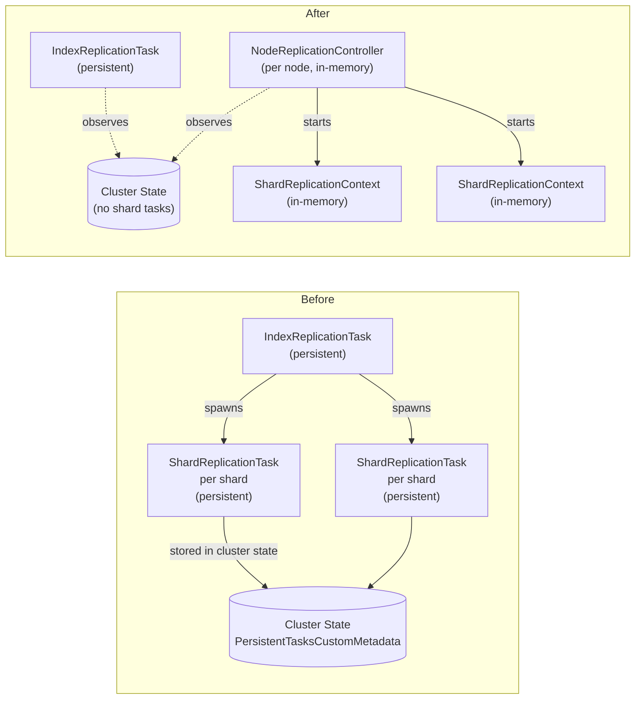
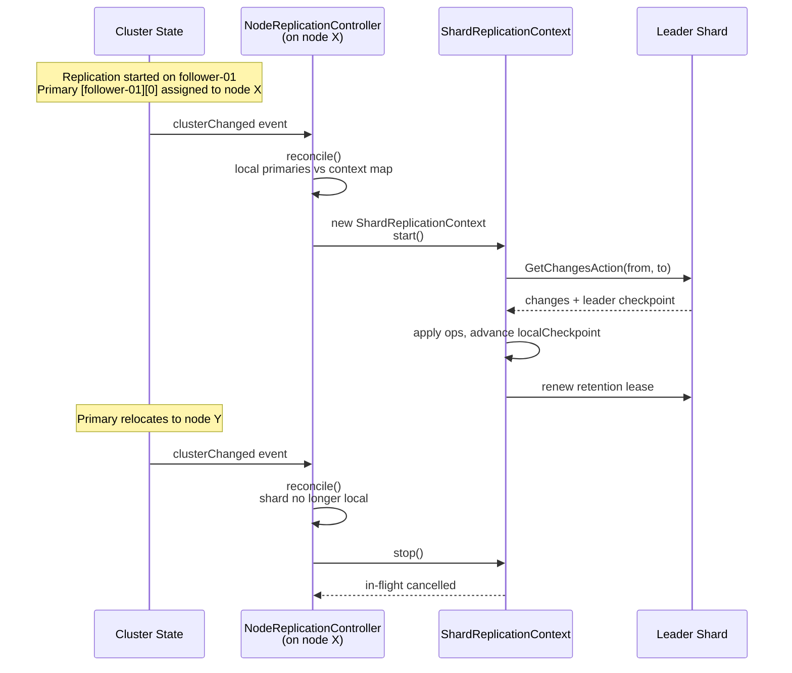

# Design: Remove `ShardReplicationTask` from Cluster State

**Status:** Draft
**Author:** Ankit Jain
**Branch:** `remove-shard-tasks`
**Target:** OpenSearch Cross-Cluster Replication

---

## TL;DR

Replace per-shard persistent tasks with a per-node in-memory controller that watches `clusterChanged` events and starts/stops shard replication workers as primaries are assigned to or relocated away from the local node.



**Why:** Per-shard persistent tasks dominate cluster state churn (1 update per shard on start/stop/pause/resume) and are the root cause for ~25 customer tickets — ghost tasks blocking restart, "Timed out waiting for persistent task," autofollow rule failures, bootstrapping/syncing inconsistencies.

**What's changing:** Code on the follower side. No protocol changes, no leader-side changes.

**What's NOT changing:** `IndexReplicationTask` (per-index, low cardinality), bootstrap flow, `GetChangesAction`, retention lease semantics, REST APIs.

**Migration:** Single batched cluster state update on plugin init removes all legacy `ShardReplicationTask` entries. Brief lag window during rolling upgrade is acceptable; no operator-mandated pause.

**Status API:** Out of scope. Follow-up PR.

---

## 1. Problem

`ShardReplicationTask` is registered as an OpenSearch persistent task — one per follower primary shard. This means:

- **Cluster state churn.** Every start/stop/pause/resume of replication produces O(shards) cluster state updates, each going through cluster manager two-phase commit. With 5000 shards, autofollow matching new indices, or pause/resume cycles, this floods cluster state publication.

- **Ghost tasks.** When a `ShardReplicationTask` fails or is orphaned (e.g. index deleted without unfollowing first), the persistent task entry can be left behind in cluster state. Restart attempts hit `resource_already_exists_exception`. Customers cannot self-recover.

- **Timeouts on lifecycle operations.** Start/stop/resume APIs wait for persistent task transitions. If the persistent task framework is slow or the task hasn't been assigned a node, operations time out with `"Timed out waiting for persistent task after 1m"`.

- **State inconsistency.** "78 bootstrapping but 110 syncing — missing index/shard replication tasks, metadata inconsistency" (Intuit ticket). Cluster state and runtime state can diverge with no automated reconciliation.

These symptoms are observable in the customer ticket trends — the top trend (Replication stuck/paused, 35 tickets) is dominated by failure modes rooted in per-shard task lifecycle.

The `ShardReplicationTask` itself is a lightweight wrapper around runtime state (`ShardReplicationChangesTracker`, `TranslogSequencer`, reader/writer scopes). The wrapper is what's expensive in cluster state. The runtime state is fine in memory.

---

## 2. Proposed Design

### 2.1 New Components

**`NodeReplicationController`** — One per data node. Started during plugin initialization. Listens to `clusterChanged` events via `ClusterStateListener`.

Responsibilities:
1. On each cluster state change, compute the set of follower primary shards assigned to this node where the index has `ReplicationOverallState.RUNNING` in `ReplicationMetadata`.
2. Compare against the current set of running `ShardReplicationContext` instances.
3. Start contexts for newly-assigned shards. Stop contexts for shards no longer locally assigned or whose index transitioned to `PAUSED` / `STOPPED`.
4. Run a periodic timer (default every 30 minutes) to renew retention leases on idle shards — closes the lease-renewal-coupled-to-fetch-loop edge.
5. Expose the per-shard context map for the future status API.

**`ShardReplicationContext`** — In-memory per-shard state. Replaces the runtime portion of `ShardReplicationTask`.

Holds:
- `leaderShardId`, `followerShardId`, `leaderAlias`
- `ShardReplicationChangesTracker` (unchanged from today)
- `TranslogSequencer` (unchanged from today)
- Reader/writer coroutine scope (own `SupervisorJob`)
- `lastLeaseRenewalMillis`
- Backoff state, last error

Lifecycle:
- `start()` — launches the replicate loop on the context's coroutine scope. Idempotent: if already running, no-op.
- `stop()` — cancels the coroutine scope. Idempotent.
- `stopAndJoin()` — cancels and awaits in-flight coroutine completion.
- `renewLeaseIfStale(threshold)` — invoked by the controller's timer. Renews the lease if `now - lastLeaseRenewalMillis > threshold`.

The `replicate()` body inside the context is essentially today's `ShardReplicationTask.replicate()` minus persistent-task wiring (`updateTaskState`, `cancelTask`, etc.).

### 2.2 What `IndexReplicationTask` Changes

`IndexReplicationTask` remains a persistent task. Its responsibilities are unchanged:

- Bootstrap (snapshot/restore, retention lease seed)
- Metadata polling (mappings, settings, aliases from leader)
- Pause / stop reactions
- Autopause logic on shard failures

What's removed:
- `startNewOrMissingShardTasks()` — no more per-shard task spawning
- `findAllShardTasks()`, `findAllReplicationFailedShardTasks()` — no shard tasks to find
- The `FollowingState(Map<ShardId, PersistentTask<ShardReplicationParams>>)` data class becomes `FollowingState` with no payload (or a simpler shard count for status purposes)
- The `pollShardTaskStatus()` polling loop — replaced by querying local controller state on each node

The state machine simplifies: `INIT → RESTORING → INIT_FOLLOW → FOLLOWING → MONITORING → ...` becomes `INIT → RESTORING → FOLLOWING → MONITORING → ...`. The `INIT_FOLLOW` state existed solely to spawn shard tasks and is no longer needed.

`pollShardTaskStatus` was also responsible for surfacing shard task failures to the index task so it could autopause. The new mechanism: each node's controller writes shard-failure state to a dedicated transport action that the index task consumes when it polls. *Or*, simpler, each context that hits its failure threshold calls a `ReportShardFailureAction` against the cluster, which updates `ReplicationMetadata` to PAUSED. We'll go with the simpler version — direct metadata mutation on terminal shard failure.

### 2.3 Coordinator-Free, Per-Node Self-Driven Model



Properties:
- No SPOF. Every node independently observes cluster state.
- No coordinator allocation. The persistent-task framework's allocation logic is no longer in the loop for per-shard work.
- Idempotent reconciliation. If reconcile runs twice on the same state, it produces the same set of running contexts.
- Self-correcting. Missed/coalesced cluster state events are picked up on the next event.

### 2.4 Lifecycle Triggers

**Start a `ShardReplicationContext`:**
- Primary shard becomes assigned to local node (routing table change) AND
- Index appears in `ReplicationMetadata` with `RUNNING` state

**Stop a `ShardReplicationContext`:**
- Primary shard no longer assigned locally (relocated, demoted, or removed)
- Index transitions to `PAUSED`
- Index removed from `ReplicationMetadata` (replication stopped)
- Index deleted

**No special trigger for bootstrap completion.** The shard primary becoming active *is* bootstrap completion (snapshot/restore creates and activates the shard). The controller's reconciler picks up the active primary on the next `clusterChanged` event after restore finishes — typically within milliseconds of the shard becoming active.

### 2.5 Idle Lease Renewal

A periodic timer in the controller (default every 30 minutes, configurable):

```kotlin
fun renewIdleLeases() {
    val threshold = leaseRenewalThreshold.millis  // default 2 hours
    contexts.values.forEach { ctx ->
        if (now() - ctx.lastLeaseRenewalMillis > threshold) {
            ctx.renewLeaseIfStale(threshold)
        }
    }
}
```

For active shards, the existing per-batch renewal in the replicate loop keeps `lastLeaseRenewalMillis` fresh — this timer is a no-op for them.

For idle shards (no traffic for hours), this is the *only* path that keeps the lease alive. Without it, leases would expire after 12h (OpenSearch default), breaking replication silently.

This addresses **Trend 1a (RetentionLeaseNotFoundException / AutoPaused — 7 tickets)** for the case where lease expiry is caused by lack of traffic rather than oversized shards.

### 2.6 Failure Handling

We preserve today's coarse autopause policy: any terminal shard failure pauses the entire index. This avoids changing observable behavior in this PR. Per-shard failure isolation and attribution are deferred to the status API follow-up.

In the new model:

1. `ShardReplicationContext` tracks `consecutiveFailures`. Transient errors are retried with exponential backoff (same as today's shard task).
2. On a terminal non-recoverable failure (e.g. `RetentionLeaseNotFoundException`, or `consecutiveFailures` exceeding threshold), the context calls `ReplicationMetadataManager.updateIndexReplicationState(index, PAUSED, reason)` directly. Single cluster state update.
3. The metadata change cascades:
   - Every node's `NodeReplicationController` observes the `PAUSED` state and stops all contexts for that index (idempotent — context already failing).
   - `IndexReplicationTask` observes the metadata change. Since the index is already paused via the metadata write, it takes no additional action (the existing pause-monitoring logic in `IndexReplicationTask` becomes the no-op consumer).
4. `_resume` API flips state to `RUNNING`. Controllers across all nodes observe the change and start fresh contexts that retry from the current `localCheckpoint`. If the underlying issue is fixed, replication resumes; if not, contexts hit the same failure and re-pause.

**Race condition note.** If multiple shards fail concurrently on different nodes, all of their contexts will call `updateIndexReplicationState(PAUSED, reason)`. Cluster state updates serialize through cluster manager — second and subsequent calls are idempotent (state already `PAUSED`) and may overwrite the `reason` field with a different shard's message. The recorded reason becomes nondeterministic. This is acceptable: operators see "the index paused, here's *a* reason" which is sufficient to start investigating. Per-shard attribution is the status API's job.

**No persistent failure metadata is added.** Today's behavior already loses per-shard attribution after the first failure triggers pause — the simpler model preserves this exact semantics. Shard-failure routing is decoupled from the index task without inventing new state.

---

## 3. Migration

### 3.1 Single Batched Cleanup

On plugin initialization, the cluster manager (and only the cluster manager) submits a single `ClusterStateUpdateTask`:

```kotlin
class CleanupShardTasksUpdateTask : ClusterStateUpdateTask(Priority.NORMAL) {
    override fun execute(currentState: ClusterState): ClusterState {
        val current = PersistentTasksCustomMetadata.getPersistentTasksCustomMetadata(currentState)
            ?: return currentState

        val keptTasks = current.tasks()
            .filter { it.taskName != ShardReplicationExecutor.TASK_NAME }
            .associateBy { it.id }

        if (keptTasks.size == current.tasks().size) return currentState  // idempotent

        val updated = PersistentTasksCustomMetadata(current.lastAllocationId, keptTasks)
        return ClusterState.builder(currentState)
            .metadata(Metadata.builder(currentState.metadata)
                .putCustom(PersistentTasksCustomMetadata.TYPE, updated))
            .build()
    }
}
```

Properties:
- **Atomic:** one publication, all shard tasks removed simultaneously.
- **Idempotent:** if no shard tasks exist (already cleaned, fresh cluster), the task returns `currentState` unchanged — no publication.
- **Cluster-manager only:** registered via a `ClusterStateListener` that fires when the local node becomes cluster manager. Deregisters after success.
- **Survives manager elections:** if the original cluster manager fails before cleanup, the new manager runs cleanup on its next `clusterChanged`.

`ShardReplicationExecutor.TASK_NAME` is the discriminator. We do *not* remove `IndexReplicationTask` entries — those continue to function.

### 3.2 Rolling Upgrade Behavior

Concrete sequence on a 3-node cluster, single index with 6 shards:

1. **t0** — All nodes on old plugin. 6 `ShardReplicationTask` entries in cluster state, 1 `IndexReplicationTask`. Replication healthy.

2. **t1** — Node A (cluster manager) restarts onto new plugin. New plugin loads. New `NodeReplicationController` initializes on A. Cleanup runs: 6 shard tasks removed atomically. Now 0 shard tasks in cluster state, but old plugin on nodes B and C still has shard tasks running locally — those workers continue to operate against their existing in-memory state. They'll be cancelled when the plugin framework on B and C notices the persistent task entries are gone, but in OpenSearch's persistent task model, *removal of the task entry triggers a stop on the assigned node*. So workers on B and C stop when cleanup runs.

   This is the lag window. Shards primary'd on B and C have no active worker for the duration of B and C's restart.

3. **t2** — Node B restarts onto new plugin. `NodeReplicationController` on B initializes. On the first cluster state event, it sees that primaries [shard 0, shard 1] are local and the index is in `ReplicationMetadata` with `RUNNING`. It starts contexts. Workers resume.

4. **t3** — Node C restarts onto new plugin. Same reconciliation. All workers running.

**Worst-case lag:** time from cleanup at t1 to last node finishing restart at t3. Typically minutes for a 3-node cluster, longer for larger clusters with longer node startup times. During this window, leader-side retention leases are still being held (we never removed them), so no data loss — replication just pauses and resumes.

**No operator-mandated pause is required.** The customer-visible impact is brief replication lag during the upgrade window, with auto-recovery.

### 3.3 Documentation Updates

- Release notes: clearly call out the brief lag window during rolling upgrade.
- Upgrade guide: no required action; replication resumes automatically.
- Internal runbook: how to verify cleanup succeeded (`GET _cluster/state?filter_path=metadata.persistent_tasks` should show no entries with `task_name == "cluster:indices/shards/replication"`).

---

## 4. What Gets Deleted vs. Retained

### 4.1 Deleted

| Component | Path | Reason |
|---|---|---|
| `ShardReplicationTask` | `task/shard/ShardReplicationTask.kt` | No longer a persistent task |
| `ShardReplicationExecutor` | `task/shard/ShardReplicationExecutor.kt` | No persistent task to execute |
| `ShardReplicationParams` | `task/shard/ShardReplicationParams.kt` | No persistent task params to serialize |
| `ShardReplicationState` | `task/shard/ShardReplicationState.kt` | State machine inlined into context |
| Plugin registration of shard task | `ReplicationPlugin.kt:312, 319, 351` | Remove |
| `startNewOrMissingShardTasks` | `IndexReplicationTask.kt:864` | No longer needed |
| `findAllShardTasks`, `findAllReplicationFailedShardTasks` | `IndexReplicationTask.kt` | No tasks to query |
| `INIT_FOLLOW` state | `IndexReplicationState.kt` | Redundant |

### 4.2 Retained (Moved to `ShardReplicationContext`)

| Component | Path | Notes |
|---|---|---|
| `ShardReplicationChangesTracker` | `task/shard/ShardReplicationChangesTracker.kt` | Unchanged, owned by context |
| `TranslogSequencer` | `task/shard/TranslogSequencer.kt` | Unchanged, owned by context |
| `replicate()` loop body | Was in `ShardReplicationTask` | Lifted into `ShardReplicationContext` |
| `getChanges()`, retention lease renewal logic | Was in `ShardReplicationTask` | Lifted into `ShardReplicationContext` |

### 4.3 New

| Component | Path |
|---|---|
| `NodeReplicationController` | `task/shard/NodeReplicationController.kt` |
| `ShardReplicationContext` | `task/shard/ShardReplicationContext.kt` |
| `CleanupShardTasksUpdateTask` | `task/shard/CleanupShardTasksUpdateTask.kt` |

---

## 5. Settings

| Setting | Default | Purpose |
|---|---|---|
| `plugins.replication.follower.lease_renewal_interval` | `30m` | Idle-lease-renewal sweep frequency |
| `plugins.replication.follower.lease_renewal_threshold` | `2h` | Max age before forced renewal |
| `plugins.replication.follower.shard_failure_threshold` | `10` | Consecutive failures before quarantine |
| `plugins.replication.follower.shard_quarantine_max_backoff` | `10m` | Max backoff for quarantined shards |

All dynamic. Existing settings (batch size, concurrent readers/writers, poll duration) are unchanged.

---

## 6. Test Plan

### 6.1 Unit Tests

- `NodeReplicationControllerTests`
  - Reconcile starts contexts for newly-assigned local primaries
  - Reconcile stops contexts for relocated-away shards
  - Reconcile is idempotent
  - Replication metadata transition RUNNING → PAUSED stops contexts
  - Idle lease renewal triggers for stale `lastLeaseRenewalMillis`

- `ShardReplicationContextTests`
  - `start()` is idempotent
  - `stop()` cancels in-flight work
  - Failure threshold transitions context to quarantine
  - Lease renewal updates `lastLeaseRenewalMillis`

- `CleanupShardTasksUpdateTaskTests`
  - Removes only entries with `task_name == ShardReplicationExecutor.TASK_NAME`
  - Returns `currentState` unchanged when no shard tasks present
  - Preserves `IndexReplicationTask` entries

### 6.2 Integration Tests

Existing CCR integ tests (most of them) should still pass — they exercise the API surface, which is unchanged. We need to update or replace tests that *directly* manipulate persistent task state.

New integ tests:

- **Primary relocation during replication.** Start replication, force shard relocation via cluster reroute, verify replication continues uninterrupted.
- **Pause/resume cycle.** Pause replication, verify all contexts stopped on all nodes. Resume, verify contexts restart and replication continues from where it left off.
- **Node restart with active replication.** Stop a node, restart it, verify the controller reconstructs contexts and resumes.
- **Migration cleanup.** Set up a state with synthetic legacy `ShardReplicationTask` entries, initialize plugin on cluster manager, verify they're removed in a single update.
- **Stop replication.** Verify all contexts on all nodes stop, and the index becomes writable.

### 6.3 Backwards-Compat Test

- Spin up a cluster with the *old* plugin. Start replication. Stop the cluster manager. Replace plugin with new version. Start the cluster manager. Verify cleanup runs and the controller picks up local shards.

This is the rolling-upgrade scenario without a full multi-version BWC test.

---

## 7. Open Questions

1. **`IndexReplicationTask`'s `pollShardTaskStatus()` is dead code in the new model** (no shard tasks to query, no autopause decisions to make — contexts handle that). Removed in this PR. The other monitoring/metadata-polling loops in `IndexReplicationTask` are unrelated and stay.

2. **What if a primary shard is allocated but not yet in `STARTED` state?** The controller should wait for `STARTED` before starting a context. Reading from a non-started shard would fail. **Resolution: filter on `ShardRouting.started()` in the reconciler.**

3. **Concurrent reconcile invocations.** `clusterChanged` events can land in rapid succession. Multiple invocations might race. **Resolution: synchronize the reconcile method, or use a single-threaded executor for the controller.** Simple, no contention concerns since reconcile work is fast.

4. **What happens to `_cat/tasks?actions=*replication*`?** Per-shard rows disappear immediately on upgrade. This is the known regression that the follow-up status API will address. **No action in this PR; document as known regression.**

---

## 8. Risks

| Risk | Mitigation |
|---|---|
| Migration cleanup runs but a node still has the old plugin and tries to reconcile shard tasks | The persistent task framework on the old plugin will see the entry vanished and stop the local task. No corruption. |
| Reconciler misses a primary-active event | Cluster state changes are observed continuously. Next event reconciles. Worst case, slight lag until next event. |
| Idle-lease timer fails (bug) and shards quietly stop renewing | Add a metric for `oldest_lease_renewal_age` per node. Alert if exceeds threshold. (Future status API.) |
| Quarantined shard stays quarantined forever | Exponential backoff caps and retries. Final fallback: operator-driven pause/resume cycles re-creates the context fresh. |
| `IndexReplicationTask` no longer gets shard failure signals via persistent tasks | Replaced with direct `ReplicationMetadata` updates from contexts on terminal failures. Verified by integ tests. |

---

## 9. Out of Scope

- Status API / metrics changes (follow-up PR)
- Removal of `IndexReplicationTask` (separate change, lower priority)
- Throttling controls (`max_buffered_bytes_per_shard`, etc.) (separate change)
- Checkpoint coordination protocol (separate, larger redesign)
- Andrew's full-cluster replication relationship-ID model (different scope)

---

*End of design draft.*
